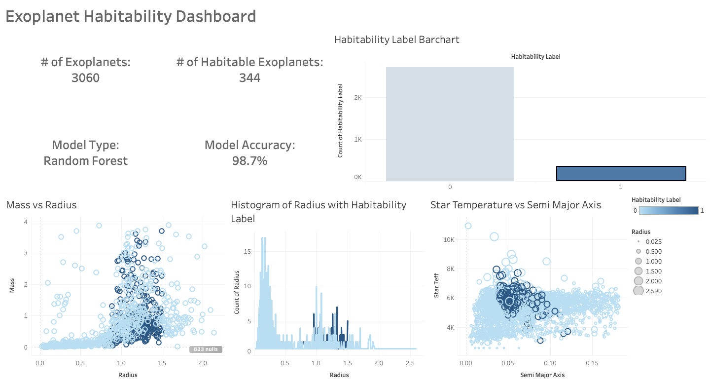

#  Exoplanet Habitability Prediction with Machine Learning and Tableau

This project uses real exoplanet data to classify whether a planet is potentially habitable based on astrophysical features. The workflow includes data cleaning, exploratory data analysis (EDA), machine learning modeling, and visualization through Tableau dashboards.

---

##  Overview

- **Goal**: Predict whether an exoplanet is in the habitable zone using a classification model
- **Data Source**: [exoplanet.eu](https://exoplanet.eu/)
- **Tech Stack**: Python, Jupyter, pandas, scikit-learn, Tableau
- **Machine Learning**: Supervised binary classification using Random Forest
- **Visualization**: Feature distribution plots and interactive Tableau dashboard

---

##  Model Summary

| Detail              | Value               |
|---------------------|---------------------|
| Model Type          | Random Forest Classifier |
| Accuracy            | 98.7%               |
| Input Features      | Radius, Star Teff, Semi-Major Axis, etc. |
| Target              | `habitability_label` (0 = not habitable, 1 = potentially habitable) |

---

##  Exploratory Data Analysis

- Feature distributions segmented by habitability
- Handling of missing values and normalization
- Outlier detection (e.g., extreme radius/mass)
- Correlation analysis between stellar and planetary properties

---

##  Tableau Dashboard

The interactive Tableau dashboard includes:
- KPIs:
  - Total planets
  - Habitable planet count
  - Model accuracy
  - Model type
- Bar charts comparing habitable vs non-habitable distributions
- Scatter plots showing feature interactions (e.g., star temp vs. radius)

 **Preview**:  

---

